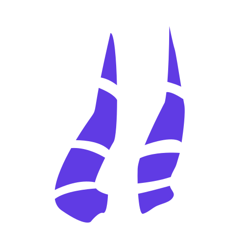

<div align="center">
  <h1>NecrassRs</h1>
  
  <p style="font-weight:bold">Your schema leads. Rust delivers.</p>
  <a href="https://github.com/Necrass-Dev/NecrassRs/actions/workflows/rust.yml"></a>
  <a href="https://sonarcloud.io/summary/new_code?id=Necrass-Dev_NecrassRs"></a>
</div>

NecrassRs is an SDL-first GraphQL server framework for Rust. Define your public API in GraphQL SDL, let Cargo generate Rust contracts and resolver scaffolding, and fill in the resolver bodies with your application logic.

> [!WARNING]
> NecrassRs is under active development. Feature support is incomplete, and APIs may change. The generated API supports built-in scalar and enum query results, ordinary and OneOf input objects, nullable and list forms, and recursive input layouts. Custom scalars, composite results, and generated mutation/subscription routing remain unsupported.

## Quick start

With Rust and Cargo installed, install the CLI from Git:

```sh
cargo install --git https://github.com/Necrass-Dev/NecrassRs.git necrassrs-cli --locked
```

The package is named `necrassrs-cli`; the installed command is `necrass`. Create and run a project:

```sh
necrass init my-api
cd my-api
cargo run
```

The target directory must be new or empty. The starter uses Git dependencies for NecrassRs. After initialization, ordinary builds and runs only require Cargo; no separate generation command is needed.

Run `necrass` without arguments in a terminal to choose the project directory, package name, and HTTP framework interactively. Explicit `init` commands do not prompt: Axum is the default, and `necrass init my-api --framework actix` selects Actix Web. Use `necrass --help` or `necrass init --help` for usage. Without a terminal, supply an explicit command.

The starter's NecrassRs dependencies are not pinned to the CLI's revision. The first build resolves them from the Git repository's default branch and records the resolved revision in the project's `Cargo.lock`.

Open [GraphiQL](http://127.0.0.1:3000/graphql) and run `{ hello(name: "Sheri") }`.
The response is `{"data":{"hello":"Hello, Sheri"}}`.

Follow the [installation and first-request guide](https://necrass.rs/docs/#install-the-cli) for prerequisites, interactive setup, Axum/Actix selection, and curl examples. See [Introspection and GraphiQL](docs/src/content/docs/docs/graphiql.md) for deployment settings.

## From schema to resolver

The starter defines its API in `schema/schema.graphql`:

```graphql
type Query {
    hello(name: String!): String!
}
```

Cargo runs `build.rs`, which calls `necrassrs_build::build("schema")`. The build library validates the SDL, generates argument types and resolver contracts, and synchronizes editable resolver declarations in `src/resolvers.rs`.

> [!IMPORTANT]
> Cargo builds write disposable generated code to `OUT_DIR` and update `src/resolvers.rs`. Retained fields keep their method bodies. Deleting or renaming a field removes its old resolver method, including any user-written body.

The starter already includes this working resolver:

```rust
pub struct Query;

impl<C: Sync> crate::generated::resolvers::QueryResolver<C> for Query {
    async fn hello(
        &self,
        _context: &C,
        args: crate::generated::types::Query::hello::Args,
    ) -> Result<String, necrassrs::ResolverError> {
        Ok(format!("Hello, {}", args.name))
    }
}
```

Your application owns routing and request Context construction. At runtime, NecrassRs validates the request, dispatches selected fields to your resolvers, and builds the GraphQL response. Return `ResolverError` for ordinary application errors.

See [Tutorial](docs/src/content/docs/docs/tutorial.md) for executable schema/resolver examples, input defaults and presence, OneOf, and recursive inputs. These examples describe the source checkout; older resolved Git revisions do not contain this support.

## Everyday development

1. Edit SDL under `schema/` to change the public API.
2. Run `cargo build` to regenerate contracts and synchronize resolver declarations.
3. Implement new resolver bodies in `src/resolvers.rs`.
4. Run `cargo run` and query the server.

Generated contracts in `OUT_DIR` are disposable. In `src/resolvers.rs`, SDL owns resolver declarations, while you own retained method bodies and unrelated application code.

| File | Purpose |
| --- | --- |
| `schema/**/*.graphql` | Your public GraphQL contract |
| `build.rs` | Calls the build library during Cargo builds |
| `src/main.rs` | Routing, request Context construction, and server setup |
| `src/resolvers.rs` | Build-managed resolver declarations with your method bodies and application state |
| `src/generated.rs` | Includes generated code from `OUT_DIR` |
| `OUT_DIR/necrassrs.rs` | Disposable contracts, argument types, embedded SDL, and dispatch; do not edit |

**Builds update `src/resolvers.rs`.** Retained methods keep their bodies, new fields receive `unimplemented!()` stubs, and deleted fields lose their methods, including their bodies. Renaming a field deletes the old method and adds a fresh stub. Unrelated application code is preserved; retained bodies may need edits when arguments change.

The starter configures `panic = "abort"` for development and release builds. Calling an unimplemented resolver terminates the process; unselected fields are not called. This setting affects all panics. Ordinary resolver errors return GraphQL responses.

## Packages

| Package | Responsibility |
| --- | --- |
| `necrassrs` | GraphQL requests, execution, resolver errors, and responses |
| `necrassrs-build` | SDL validation, Rust generation, and resolver source synchronization |
| `necrassrs-axum` | Axum request extraction, response conversion, and GraphiQL |
| `necrassrs-actix` | Actix Web request extraction, response conversion, and GraphiQL |
| `necrassrs-http` | Framework-independent response media-type negotiation shared by the Axum and Actix adapters |
| `necrassrs-cli` | The `necrass init` project initializer |

Applications normally depend on their HTTP adapter, which uses `necrassrs-http` internally. The shared package does not execute GraphQL or run a server. Axum routes use the adapter's `negotiate_response` middleware; Actix integrates negotiation into its extractor and responder.

## Further reading

- [Axum server example](examples/axum-server/README.md): run a workspace example and explore requests, errors, and manual setup details.
- [Actix server example](examples/actix-server/README.md): run generated resolvers through Actix Web with built-in GraphiQL.
- [Introspection and GraphiQL](docs/src/content/docs/docs/graphiql.md): configure the development UI and introspection policy.

To browse local API documentation from a checkout of this repository:

```sh
cargo doc --workspace --no-deps --locked --open
```
