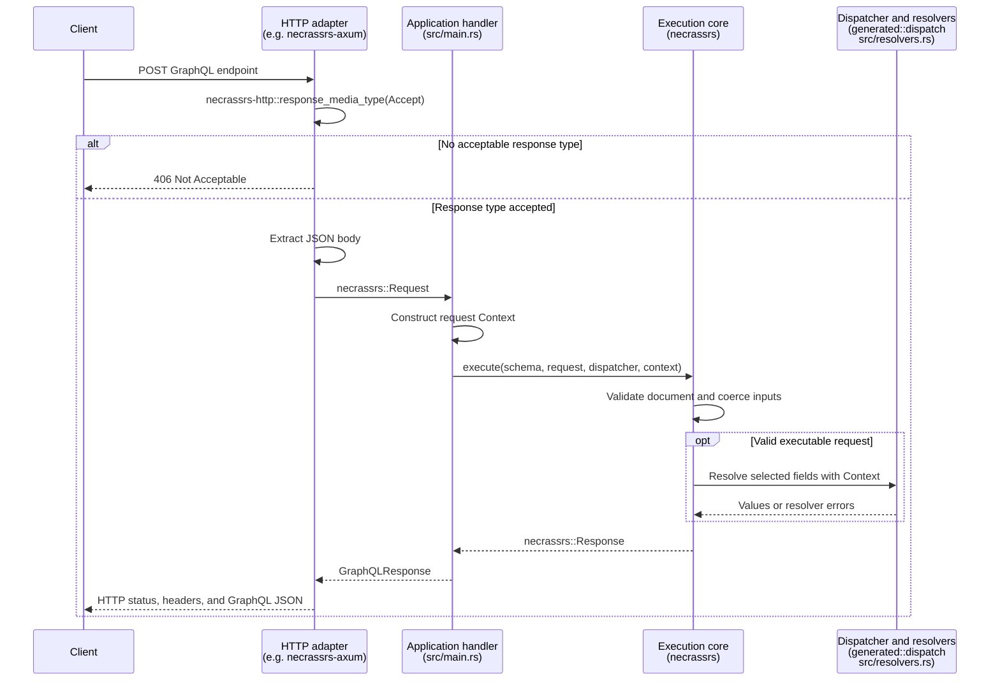

NecrassRs integrates with backend frameworks through HTTP adapters. An adapter connects a framework's request and response types to the GraphQL execution core, so you can serve GraphQL alongside the rest of your application.

## How it works

Applications own routing, middleware, shared state, and per-request Context construction. Register a GraphQL handler on an application-chosen route; the adapter extracts its request and converts its response.

For a JSON POST request, the flow is:

1. The framework routes the request to your GraphQL endpoint and applies application middleware.
2. The adapter checks response media-type preferences and extracts the JSON body into a `necrassrs::Request`.
3. Your handler constructs Context and calls `necrassrs::execute` with the validated schema, request, dispatcher, and Context.
4. The execution core parses and validates the GraphQL document, selects an operation, coerces variables, and invokes resolvers through the dispatcher.
5. The adapter serializes the returned `necrassrs::Response` and sets the HTTP status and response headers.

This sequence shows the request and response boundaries. The adapter's extraction and response conversion run within the application's framework route.



`necrassrs-build` generates resolver contracts and the dispatcher from SDL during the Cargo build; it is not part of the HTTP request flow. At startup, the application validates `generated::SDL` with `necrassrs::Schema::parse_and_validate` and stores the schema and dispatcher in shared state. Each handler borrows that state and supplies its own Context. Authentication, database connections, and other request-specific values remain application concerns.

The execution core does not depend on an HTTP framework or on `necrassrs-http`. An adapter does not need to generate code or implement GraphQL execution. To configure introspection, the handler can call `execute_with_options`; see [Introspection and GraphiQL](https://necrass.rs/docs/graphiql/).

## Supported frameworks

The following adapters are maintained in this repository:

| Backend framework | Adapter crate     | CLI `--framework` value | Usage                               |
| ----------------- | ----------------- | ----------------------- | ----------------------------------- |
| Axum              | `necrassrs-axum`  | `axum`                  | [Axum integration](#axum)           |
| Actix Web         | `necrassrs-actix` | `actix`                 | [Actix Web integration](#actix-web) |

For a new project, use `necrass init <PATH> --framework <FRAMEWORK>` with a value from the table. See [Create a project](https://necrass.rs/docs/#create-a-project) for package naming and interactive setup.

For an existing application, add its adapter dependency and register a handler as shown below. The [Axum example](https://github.com/Necrass-Dev/NecrassRs/tree/main/examples/axum-server) and [Actix Web example](https://github.com/Necrass-Dev/NecrassRs/tree/main/examples/actix-server) include manifests, build scripts, SDL, and resolver implementations. Dependency placement and generated project files are documented in [Consumer project setup](architecture.md#71-initial-cli-scope).

If your framework is not listed, you can [write an adapter](#writing-an-adapter) using the same public runtime API.

## Using an adapter

Both maintained adapters expose `GraphQLRequest` and `GraphQLResponse`. The request wrapper contains the runtime request; the response wrapper accepts the result of execution. The examples below assume application state named `AppState` with `schema` and `dispatcher` fields, as in the consumer examples, and use `()` as Context.

`necrassrs-http` contains the response media-type selection shared by both adapters. It parses `Accept` preferences, applies quality and specificity rules, and handles explicit exclusions. It does not execute GraphQL, read request bodies, run a server, or own application routes. Applications normally depend on their adapter, which brings this package transitively.

### Axum

Extract shared state and the GraphQL request in your handler:

```rust
use std::sync::Arc;
use axum::extract::State;
use necrassrs_axum::{GraphQLRequest, GraphQLResponse};

async fn graphql(
    State(state): State<Arc<AppState>>,
    GraphQLRequest(request): GraphQLRequest,
) -> GraphQLResponse {
    let context = ();
    GraphQLResponse(
        necrassrs::execute(&state.schema, &request, &state.dispatcher, &context).await,
    )
}
```

Place `GraphQLRequest` last in the handler's extractors because it consumes the body. Configure body limits with Axum's `DefaultBodyLimit`.

Attach `negotiate_response` using the GraphQL method router's `route_layer`. This applies negotiation only to registered methods and preserves 405 responses for unsupported methods regardless of `Accept`. It keeps the existing `GraphQLRequest(request)` and `GraphQLResponse(response)` handler API:

```rust
use axum::{Router, middleware, routing::{get, post}};
use necrassrs_axum::{graphiql_html, negotiate_response};

let app = Router::new()
    .route("/graphql", post(graphql).route_layer(middleware::from_fn(negotiate_response)))
    .route("/graphql", get(|| async { graphiql_html("/graphql") }))
    .with_state(state);
```

Axum's `IntoResponse` receives no request headers. The middleware reads `Accept` before invoking the handler and sets the content type only on responses produced by `GraphQLResponse`. Framework rejections and other responses retain their own formats. It appends `Vary: Accept` without replacing existing `Vary` values.

Without this middleware, `GraphQLResponse` preserves the existing `application/json` response behavior. The axum-server example and CLI template include the middleware. Mount it on the GraphQL route rather than wrapping GraphiQL HTML routes.

### Actix Web

`GraphQLRequest` implements Actix's `FromRequest`; `GraphQLResponse` implements `Responder`. The extractor checks acceptable response types before GraphQL execution, and the responder reads `Accept` directly from `HttpRequest`. No additional negotiation middleware is needed.

Use `web::Data` for application state and construct Context inside the handler. Configure JSON limits with `web::JsonConfig::limit`. Standard JSON extraction errors are mapped to the status codes below; custom JSON error handlers returning other error types retain their own responses.

```rust
use actix_web::web;
use necrassrs_actix::{GraphQLRequest, GraphQLResponse};

async fn graphql(
    state: web::Data<AppState>,
    GraphQLRequest(request): GraphQLRequest,
) -> GraphQLResponse {
    let context = ();
    GraphQLResponse(
        necrassrs::execute(&state.schema, &request, &state.dispatcher, &context).await,
    )
}

fn configure(cfg: &mut web::ServiceConfig) {
    cfg.service(web::resource("/graphql").route(web::post().to(graphql)));
}
```

Register `configure` on your `App` and attach state with `.app_data(web::Data::new(state))`. Consume the body only once: other handler extractors must not read it again.

Both adapters also provide an optional `graphiql_html` helper. Register it on an application-owned GET route separately from GraphQL POST execution; see [Introspection and GraphiQL](https://necrass.rs/docs/graphiql/).

## HTTP behavior

The following contract describes the maintained adapters. Use it as the compatibility baseline for a new HTTP adapter.

### Media types

- Send JSON request bodies with `Content-Type: application/json`.
- Prefer `Accept: application/graphql-response+json`; `application/json` remains supported for legacy clients.
- Quality weights (`q`), multiple header values, media-range wildcards, and specific `q=0` exclusions are respected. Equal quality prefers GraphQL JSON.
- Missing `Accept` preserves the JSON preference. An invalid header or no acceptable supported media type returns 406 before GraphQL execution.
- Negotiated runtime responses include `Vary: Accept`. Successful HTTP responses use the selected media type. Runtime request-error responses use `application/graphql-response+json`, including for legacy JSON clients, to distinguish them from intermediary HTTP errors.
- Non-GraphQL extraction failures retain framework error bodies; they are not labeled `application/graphql-response+json`.

For example:

```sh
curl -i http://127.0.0.1:3000/graphql \
  -H 'Content-Type: application/json' \
  -H 'Accept: application/graphql-response+json' \
  --data '{"query":"{ hello(name: \"Sheri\") }"}'
```

### Status and error contract

| Condition                                                             | HTTP status | Response behavior                            |
| --------------------------------------------------------------------- | ----------- | -------------------------------------------- |
| Successful execution                                                  | 200         | GraphQL `data`                               |
| Execution errors, including partial data or `data: null`              | 200         | GraphQL `data` and `errors`                  |
| GraphQL document syntax error                                         | 400         | GraphQL `errors`, no `data`                  |
| GraphQL validation, operation selection, or variable coercion failure | 422         | GraphQL `errors`, no `data`                  |
| Malformed JSON body                                                   | 400         | Framework extraction error                   |
| Missing or incorrectly typed request fields                           | 422         | Framework extraction error                   |
| Missing or unsupported request Content-Type                           | 415         | Framework extraction error                   |
| Body exceeds configured JSON limit                                    | 413         | Framework extraction error                   |
| No acceptable response media type or invalid Accept                   | 406         | Empty HTTP error response                    |
| Unsupported method on a POST-only resource                            | 405         | Framework route response, with `Allow: POST` |

The runtime distinguishes Apollo AST parsing failures from validation failures without interpreting diagnostic messages. `Response::is_syntax_error()` exposes that distinction to adapters; the classification is not serialized into GraphQL responses. Manually constructed `Response::request_error(s)` values remain general request errors.

NecrassRs deliberately does not adopt HTTP 294. Completed execution results use 200 even when errors propagate to a null root. See the [maintainer decision in #18](https://github.com/Necrass-Dev/NecrassRs/issues/18#issuecomment-5843384906).

## Writing an adapter

An adapter can live in your application or in a separate crate. There is no adapter registration API or required adapter trait in the execution core. Implement your framework's native extraction and response conversion interfaces, or perform the conversion in a handler. The `GraphQLRequest` and `GraphQLResponse` names are conventions used by the maintained adapters.

Use these implementations as references:

- [Axum adapter source](https://github.com/Necrass-Dev/NecrassRs/blob/main/crates/necrassrs-axum/src/lib.rs): `FromRequest`, `IntoResponse`, and negotiation middleware.
- [Actix Web adapter source](https://github.com/Necrass-Dev/NecrassRs/blob/main/crates/necrassrs-actix/src/lib.rs): `FromRequest`, `Responder`, and negotiation through the request object.
- [Shared HTTP source](https://github.com/Necrass-Dev/NecrassRs/blob/main/crates/necrassrs-http/src/lib.rs): framework-independent response media-type selection.

### Extract the request

Use your framework's JSON parser and body-limit configuration. Read a required string `query`, an optional object `variables`, and an optional string `operationName`. The maintained adapters also accept `null` for either optional field and treat it as absent. Reject malformed JSON, missing or incorrectly typed fields, unsupported content types, and oversized bodies using the [status contract](#status-and-error-contract).

Construct `Request::new(query)`, then call `with_variables(variables)` and `with_operation_name(operation_name)` when those values are present. Use `necrassrs::JsonMap` for variables. Request construction does not validate GraphQL; pass the request to execution and let the runtime handle document validation and coercion.

### Negotiate the response type

Depend directly on `necrassrs-http` to reuse `response_media_type`. Pass all `Accept` header values as strings, preserving multiple values. An empty iterator means the header is absent and selects `application/json`. A malformed value or `None` result must produce 406 before GraphQL execution. Reject header values that cannot be read as strings rather than treating them as missing.

Negotiation needs access to the incoming headers. If your framework's response conversion interface cannot access the request, select the type in route middleware or carry it from extraction to response conversion. Apply negotiation to the GraphQL execution route, preserving framework method rejections and separate HTML routes.

### Convert the runtime response

Let the application handler call `execute` or `execute_with_options`; it owns the schema, dispatcher, and Context. Convert the returned `Response` using its public classification methods:

1. `is_syntax_error()` selects 400.
2. Otherwise, `is_request_error()` selects 422.
3. All execution responses select 200, including partial data and `data: null` with errors.

Serialize `Response` directly with Serde. For a 200 response, use the negotiated media type. For runtime request errors, use `necrassrs_http::GRAPHQL_JSON`. Include `Vary: Accept` without discarding existing values. Keep framework extraction errors separate from GraphQL response serialization.

Do not classify responses by matching diagnostic text, counting errors, or checking whether `data` is null. Those approaches lose the distinction between request and execution errors. Leave resolver errors, field paths, and null propagation to the runtime.

### Verify and document the integration

Exercise the adapter through your framework's HTTP test utilities. Cover request fields and types, variables and operation selection, per-request Context, the status table, and negotiation with absent, repeated, weighted, excluded, and invalid `Accept` values. Check that unacceptable response types prevent execution, body-limit configuration still works, and unrelated routes retain their own behavior.

The [Axum HTTP tests](https://github.com/Necrass-Dev/NecrassRs/blob/main/crates/necrassrs-axum/tests/http.rs) and [Actix Web HTTP tests](https://github.com/Necrass-Dev/NecrassRs/blob/main/crates/necrassrs-actix/tests/http.rs) provide concrete cases. Include a runnable consumer showing handler registration, application state, and Context construction, and document any transport limitations or differences from this contract.

A reusable adapter does not automatically become a CLI option. To add a maintained framework to this repository, add its adapter and tests to the Cargo workspace, supply a consumer example, and update this page's support table. If the CLI should generate projects for it, also add its framework choice, starter files, and generated-project checks in `necrassrs-cli`.

## Scope and verification

These behaviors and acceptance cases are informed by [GraphQL-over-HTTP revision 3903e680](https://github.com/graphql/graphql-over-http/blob/3903e68045982cb6710880bf03527aa0e9331667/spec/GraphQLOverHTTP.md). This is a draft reference, not a claim of complete HTTP conformance or the final acceptance baseline for #18.

The current fixtures and starter expose GraphQL execution through POST. GET query extraction, GET mutation handling, subscription transports, and the remaining #18 conformance matrix are outside this implementation. A GraphiQL GET page is not a GraphQL GET execution endpoint. Body limits remain framework configuration, not a GraphQL-mandated byte count.

Run the focused checks with:

```sh
cargo test -p necrassrs-http -p necrassrs-axum -p necrassrs-actix --locked
```
